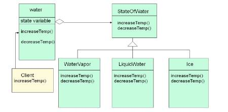

Qs. Consider the UML Class Diagram and suggest a suitable design pattern and implement in JAVA.




Answer : 
The UML diagram provided represents the State Design Pattern. This pattern allows an object to change its behavior when its internal state changes.


Implementation in JAVA

```

// State interface
interface WaterState {
    void increaseTemp(Water water);
    void decreaseTemp(Water water);
}

// Concrete States
class LiquidWater implements WaterState {
    public void increaseTemp(Water water) {
        System.out.println("Turning into Water Vapor");
        water.setState(new WaterVapor());
    }
    
    public void decreaseTemp(Water water) {
        System.out.println("Turning into Ice");
        water.setState(new Ice());
    }
}

class Ice implements WaterState {
    public void increaseTemp(Water water) {
        System.out.println("Turning into Liquid Water");
        water.setState(new LiquidWater());
    }
    
    public void decreaseTemp(Water water) {
        System.out.println("Already Ice");
    }
}

class WaterVapor implements WaterState {
    public void increaseTemp(Water water) {
        System.out.println("Already Water Vapor");
    }
    
    public void decreaseTemp(Water water) {
        System.out.println("Turning into Liquid Water");
        water.setState(new LiquidWater());
    }
}

// Context Class
class Water {
    private WaterState currentState;

    public Water(WaterState state) {
        this.currentState = state;
    }

    public void setState(WaterState newState) {
        this.currentState = newState;
    }

    public void increaseTemp() {
        currentState.increaseTemp(this);
    }

    public void decreaseTemp() {
        currentState.decreaseTemp(this);
    }
}

// Client Class
public class Client {
    public static void main(String[] args) {
        Water water = new Water(new LiquidWater());
        water.increaseTemp(); // Turns into Water Vapor
        water.decreaseTemp(); // Turns back into Liquid Water
        water.decreaseTemp(); // Turns into Ice
    }
}
```


